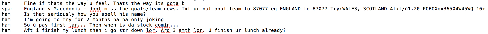

# Spam-SMS-Classifier

Spam detection is one of the major applications of Machine Learning in the interwebs today. Pretty much all of the major email service providers have spam detection systems built in and automatically classify such mail as 'Junk Mail'. 

 We will be using the Naive Bayes algorithm to create a model that can classify SMS messages as spam or not spam, based on the training we give to the model. It is important to have some level of intuition as to what a spammy text message might look like. Usually they have words like 'free', 'win', 'winner', 'cash', 'prize' and the like in them as these texts are designed to catch your eye and in some sense tempt you to open them. Also, spam messages tend to have words written in all capitals and also tend to use a lot of exclamation marks. To the recipient, it is usually pretty straightforward to identify a spam text and our objective here is to train a model to do that for us!

# Overview

This project has been broken down in to the following steps: 
	Step 0: Introduction to the Naive Bayes Theorem
	Step 1.1: Understanding our dataset
	Step 1.2: Data Preprocessing
	Step 2.1: Bag of Words(BoW)
	Step 2.2: Implementing BoW from scratch
	Step 2.3: Implementing Bag of Words in scikit-learn
	Step 3.1: Training and testing sets
	Step 3.2: Applying Bag of Words processing to our dataset.
	Step 4.1: Bayes Theorem implementation from scratch
	Step 4.2: Naive Bayes implementation from scratch
	Step 5: Naive Bayes implementation using scikit-learn
	Step 6: Evaluating our model
	Step 7: Conclusion

## Understanding the dataset

We will be using a dataset originally compiled and posted on the UCI Machine Learning repository which has a very good collection of datasets for experimental research purposes. If you're interested, you can review the abstract and the original compressed data file on the UCI site. For this exercise, however, we've gone ahead and downloaded the data for you.



The columns in the data set are currently not named and as you can see, there are 2 columns. 

The first column takes two values, 'ham' which signifies that the message is not spam, and 'spam' which signifies that the message is spam. 

The second column is the text content of the SMS message that is being classified.

## Bag of words

Bag of Words(BoW) concept which is a term used to specify the problems that have a 'bag of words' or a collection of text data that needs to be worked with. The basic idea of BoW is to take a piece of text and count the frequency of the words in that text. It is important to note that the BoW concept treats each word individually and the order in which the words occur does not matter.


## Bayes Formula


where A and B are events and P(B) != 0

* P(A|B) is a conditional probability: the likelihood of event A occuring given that B is true.

* P(B|A) is a conditional probability: the likelihood of event B occuring given that A is true.

* P(A) and P(B) are the probabilities of observing A and B independently of each other; this is known as the marginal probability.

## Evaluation of model

Now that we have made predictions on our test set, our next goal is to evaluate how well our model is doing. There are various mechanisms for doing so, but first let's do quick recap of them.

**Accuracy** measures how often the classifier makes the correct prediction. It’s the ratio of the number of correct predictions to the total number of predictions (the number of test data points).

**Precision** tells us what proportion of messages we classified as spam, actually were spam. It is a ratio of true positives(words classified as spam, and which are actually spam) to all positives(all words classified as spam, irrespective of whether that was the correct classification), in other words it is the ratio of

[True Positives/(True Positives + False Positives)]

**Recall** (sensitivity) tells us what proportion of messages that actually were spam were classified by us as spam. It is a ratio of true positives(words classified as spam, and which are actually spam) to all the words that were actually spam, in other words it is the ratio of

[True Positives/(True Positives + False Negatives)]

The **F1 score** is the harmonic average of the precision and recall, where an F1 score reaches its best value at 1 (perfect precision and recall) and worst at 0.

## Code

``` python

import pandas as pd
from sklearn.feature_extraction.text import CountVectorizer
from sklearn.model_selection import train_test_split
from sklearn.naive_bayes import MultinomialNB
from sklearn.metrics import accuracy_score, precision_score, recall_score, f1_score

df = pd.read_table('smsspamcollection/SMSSpamCollection', sep='\t', header=None, names=['label', 'sms_message'])
df['label'] = df.label.map({'ham':0, 'spam':1})

count_vector = CountVectorizer(stop_words='english')
X_train, X_test, y_train, y_test = train_test_split(df['sms_message'], df['label'], random_state=1)

count_vector = CountVectorizer()
training_data = count_vector.fit_transform(X_train)
testing_data = count_vector.transform(X_test)

naive_bayes = MultinomialNB()
naive_bayes.fit(training_data, y_train)
predictions = naive_bayes.predict(testing_data)
print('Accuracy score: ', format(accuracy_score(y_test, predictions)))
print('Precision score: ', format(precision_score(y_test, predictions)))
print('Recall score: ', format(recall_score(y_test, predictions)))
print('F1 score: ', format(f1_score(y_test, predictions)))

```
## Output

```json

Accuracy score:  0.9885139985642498
Precision score:  0.9720670391061452
Recall score:  0.9405405405405406
F1 score:  0.9560439560439562

```

## Conclusion

>One of the major advantages that Naive Bayes has over other classification algorithms is its ability to handle an extremely large number of features. In our case, each word is treated as a feature and there are thousands of different words. Also, it performs well even with the presence of irrelevant features and is relatively unaffected by them. The other major advantage it has is its relative simplicity. Naive Bayes' works well right out of the box and tuning it's parameters is rarely ever necessary, except usually in cases where the distribution of the data is known. It rarely ever overfits the data. Another important advantage is that its model training and prediction times are very fast for the amount of data it can handle.